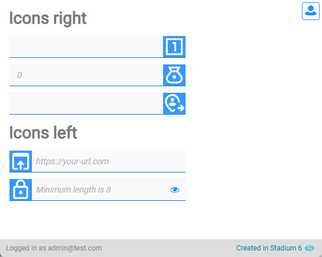

# Textbox Icons

Leading or trailing icons in TextBoxes can be used purely for aesthetic reasons, but they can also help users understand the purpose of a textbox at a glance. 



# Version 
2.0 Simplified version

Looking for [version 1](v1/)?

## Application Setup
1. Check the *Enable Style Sheet* checkbox in the application properties

## Page Setup
1. Drag a *TextBox* control to a page
2. Add a class to uniquely identify the control on this page to the control classes property (e.g. tb1)

## CSS
To apply an icon to a textbox, you need to add some CSS to your stylesheet. 

The example below shows how to write CSS that displays icons on the left- or the right-hand side of a textbox. All textboxes that need an icon on the left also need the "icon-textbox-left" class and all those shwoing icons on the right the "icon-textbox-right" class. 

Example CSS
```css
/*Icon Textboxes*/
.icon-textbox-left input {
	padding-left: 44px;
    background-repeat: no-repeat;
    background-size: 38px;
    background-position: left center;
}
.icon-textbox-right input {
	padding-right: 44px;
    background-repeat: no-repeat;
    background-size: 38px;
    background-position: right center;
}
.tb1 input {
    background-image: url("data:image/svg+xml,%3Csvg xmlns='http://www.w3.org/2000/svg' width='1em' height='1em' viewBox='0 0 24 24'%3E%3C!-- Icon from Material Symbols by Google - https://github.com/google/material-design-icons/blob/master/LICENSE --%3E%3Cpath fill='%23ffffff' d='M12 17h2V7h-4v2h2zm9 4H3V3h18zM5 19h14V5H5zM5 5v14z'/%3E%3C/svg%3E"),
    linear-gradient(90deg, var(--MAIN-THEME-COLOR) 0, var(--MAIN-THEME-COLOR) 38px);
}
```