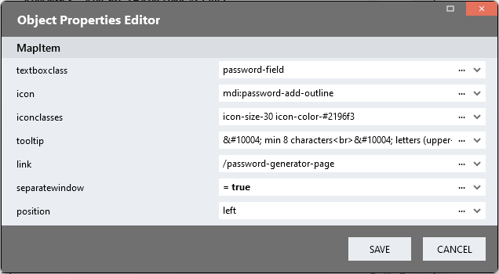

# Textbox Icons

Leading or trailing icons in TextBoxes can be used purely for aesthetic reasons, but they can also help users understand the meaning of the field in one quick glance. Tooltips on icons can provide users with further explanations about fields. 

# Version 
1.0 Initial

## Dependency
1. The [Icons](https://github.com/stadium-software/icons) module must be implemented in the application
2. The [Tooltip](https://github.com/stadium-software/tooltips) module is required if tooltips are to be shown on the TextBox icons

There is no need to call these scripts as they will be called by the "TextBoxIcon" script below. The Global Scripts and CSS files for both modules must, however, exist in the application. 

## Application Setup
1. Check the *Enable Style Sheet* checkbox in the application properties

## Type Setup
1. Create a new Type and call it "TextBoxIcon"
2. Add the two properties below to the type
   1. textboxclass (Any)
   2. icon (Any)
   3. iconclasses (Any)
   4. tooltip (Any)
   5. link (Any)
   6. separatewindow (Any)
   7. position (Any)

## Global Script Setup
1. Create a Global Script called "TextBoxIcon"
2. Add the following inpu parameter to the script
   1. TextBoxIcons
3. Drag a *JavaScript* action into the script
4. Add the Javascript below into the JavaScript code property
```javascript
let data = ~.Parameters.Input.TextBoxIcons;
let containerClassName = "container";
let callTooltip = async (classname, content) => {
    await this.$globalScripts().Tooltip(classname, content);
};
let icons = async () => {
    await this.$globalScripts().Icons(containerClassName);
};
let initTextBoxes = () => {
    for (let i = 0; i < data.length; i++) {
        let textboxclass = data[i].textboxclass;
        let textbox = document.querySelector(".text-box-container." + textboxclass);
        textbox.setAttribute("textbox-icon", "");
        let iconContainer = document.createElement("div");
        let iconSpan = document.createElement("span");
        iconContainer.appendChild(iconSpan);
        let icon = data[i].icon;
        if (!icon) {
            continue;
        }
        let iconclasses = data[i].iconclasses;
        let position = data[i].position;
        if (iconclasses && position) {
            iconclasses += " " + position;
        } else if (position) {
            iconclasses = position;
        } else if (!iconclasses) { 
            iconclasses = "";
        }
        iconContainer.setAttribute("class", iconclasses);
        let iconContainerClass = textboxclass + "_icon";
        iconContainer.classList.add("icon-container", "stadium-icon", icon, iconContainerClass);
        let link = data[i].link;
        let separatewindow = data[i].separatewindow;
        if (link) {
            iconContainer.style.cursor = "pointer";
            iconContainer.setAttribute("separatewindow", separatewindow);
            iconContainer.setAttribute("link", link);
            iconContainer.addEventListener("click", function (e) {
                let clicked = e.target;
                if (!clicked.classList.contains("icon-container")) {
                    clicked = clicked.closest(".icon-container");
                }
                let swindow = clicked.getAttribute("separatewindow");
                let lnk = clicked.getAttribute("link");
                if (swindow == "true" && lnk) {
                    window.open(lnk, "_blank");
                } else if (lnk) {
                    location.href = lnk;
                }
            });
        }

        let input = textbox.querySelector(".text-box-input");
        if (textbox.querySelector(".password-input-container")) {
            input = textbox.querySelector(".password-input-container");
        }
        input.style.gridArea = "textbox";
        textbox.insertBefore(iconContainer, input);
        let tooltip = data[i].tooltip;
        if (tooltip) callTooltip(iconContainerClass, tooltip);
    }
    icons();
};
let wait = async (milliseconds) => new Promise((resolve) => setTimeout(resolve, milliseconds));
let init = () => {
    wait(100).then(() => initTextBoxes());
};
init();
```

## Page Setup
1. Drag *TextBox* control to a page
2. Add a class to uniquely identify the control on this page to the control classes property (e.g. number-field)

## Page.Load Setup
1. Drag a *List* control into the Page.Load event handler and name it (e.g. TextBoxIconsList)
2. Select the "TextBoxIcon" type in the *Item Type* property dropdown of the *List*
3. In the *Value* property of the *List*, select *Items* in the dropdown or use the ... button to open the ListEditor


4. In the *ListEditor*, select *Object Properties* in the dropdown or use the ... button to open the ObjectEditor


5. Use the *Object Editor* to add your workflow steps
   1. textboxclass (string): The classname that uniquely identifies the textBox control
   2. icon: In order to display an icon, you must 
      1. Implement the [Icons](https://github.com/stadium-software/icons) module
      2. Locate the icon name (see [Finding an icon](https://github.com/stadium-software/icons#finding-an-icon))
      3. Copy the name of the symbol (e.g. ic:sharp-check or svg-spinners:gooey-balls-1) and paste it into the icon parameter
   3. iconclasses: Optionally, icon colours and sizes can also be defined as classes (space-separated) (e.g. icon-size-16 icon-color-red) (see [Icon Styles](https://github.com/stadium-software/icons#icon-styles))
   4. tooltip (html): Optionally, add a tooltip to display on hover. This requires the [Tooltip](https://github.com/stadium-software/tooltips) module to be implemented in the application
   5. link (URL): Optionally, provide a link to browse to on click of the icon
   6. separatewindow (boolean; default is false): Set this to "true" if the link click should result in a new browser tab to be opened
   7. position (default is right): Define if the icons should be placed on the right or the left of the TextBox field (note that password fields and other field types might already have an icon on the right)

 

6. Drag the Global Script called "TextBoxIcon" into the Page.Load EventHandler
7. Provide value for the script input parameters
   1. TextBoxIcons: Select the List containing the TextBox icons (e.g. "TextBoxIconsList")

# Styling
Various elements in this module can be styled using the two CSS files in this repo

## Applying the CSS

**Stadium 6.6 or higher**
1. Create a folder called "CSS" inside of your Embedded Files in your application
2. Drag the two CSS files from this repo [*textbox-icons-variables.css*](textbox-icons-variables.css) and [*textbox-icons.css*](textbox-icons.css) into that folder
3. Paste the link tags below into the *head* property of your application
```html
<link rel="stylesheet" href="{EmbeddedFiles}/CSS/textbox-icons.css">
<link rel="stylesheet" href="{EmbeddedFiles}/CSS/textbox-icons-variables.css">
``` 


**Versions lower than 6.6**
1. Copy the CSS from the two css files into the Stylesheet in your application

## Customising CSS
1. Open the CSS file called [*textbox-icons-variables.css*](textbox-icons-variables.css) from this repo
2. Adjust the variables in the *:root* element as you see fit
3. Overwrite the file in the CSS folder of your application with the customised file

## CSS Upgrading
To upgrade the CSS in this module, follow the [steps outlined in this repo](https://github.com/stadium-software/samples-upgrading)
